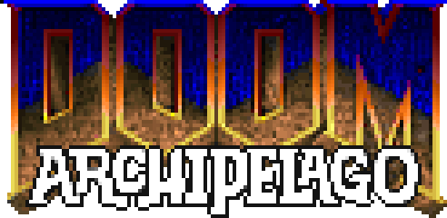

# Archipelago Doom

_Version 0.1.0 (beta)_

To be used with [Archipelago](archipelago.gg).

## Usage

1. Download the zip from the release page.
2. Extract on your PC.
3. Copy your DOOM.WAD into the newly extracted folder.
4. Run `crispy-setup.exe` if you wish to change key bindings or MIDI synth.
5. Run APDoomLauncher.exe.
6. Rip and tear!

### DOOM.WAD

The rules were built using the WAD file found in the Steam release of DOOM. It wasn't tested with other WAD files, but if the levels are identical, it should work. Shareware DOOM1.WAD won't work yet. Episode selection options still not implemented.

## Archiving a Release

1. Generate the project with CMake into `build/`. Crispy-DOOM repository setup doesn't use submodules and `add_subdirectory`, so it can be a bit tricky to get to work. Recommended using cmake GUI and install the libraries manually. See the next section for a bit more info on how I got this to work.
2. Open the solution, select crispy-doom project and build in Release.
3. Create a temporary folder `Release/`.
4. Copy the `crispy-doom.exe` into `Release/`.
5. Copy the following DLLs from your library installs, into `Release/`:
    * SDL2.dll
    * SDL2_mixer.dll
    * samplerate.dll
    * libfluidsynth-3.dll
    * intl.dll
    * libglib-2.0-0.dll
    * libsndfile-1.dll
    * libgthread-2.0-0.dll
6. Compile the C# project "Launcher" in Release, and put it into `Release/`.
7. Copy `APDOOM.WAD` into `Release/`
8. Copy `DOOM.WAD` into `Release/` (For testing!)
9. Run locally to see that everything works
10. Archive the content of `Release/` directly.
    * Do not include subfolders with `AP_####...` format. Those are saves.
    * DO NOT INCLUDE `DOOM.WAD`.

## CMake Setup

### Install required libraries

Create a folder on your PC to install libraries. I've put them in `C:\libs\`.
Find, Download and install/unzip the following libs:
- fluidsynth-2.3.2-winXP-x86
- libsamplerate-0.2.2-win32
- SDL2-2.26.5
- SDL2_mixer-2.6.3

### CMake configuration

For this specific project, I recommend using the CMake GUI tool on Windows. I had a lot of manual setup to do.

|Name|Value|
|-|-|
|FluidSynth_INCLUDE_DIRS|C:\libs\fluidsynth-2.3.2-winXP-x86\include|
|FluidSynth_LIBRARIES|C:\libs\fluidsynth-2.3.2-winXP-x86\lib\fluidsynth.lib|
|SAMPLERATE_INCLUDE_DIR|C:\libs\libsamplerate-0.2.2-win32\include|
|SAMPLERATE_LIBRARY|C:\libs\libsamplerate-0.2.2-win32\lib\samplerate.lib|
|SDL2_DIR|C:\libs\SDL2-2.26.5\cmake|
|SDL2_MIXER_DIR|C:\libs\SDL2_mixer-2.6.3|
|SDL2_MIXER_INCLUDE_DIR|C:\libs\SDL2_mixer-2.6.3\include|
|SDL2_MIXER_LIBRARY|C:\libs\SDL2_mixer-2.6.3\lib\x86\SDL2_mixer.lib|


## Generating Rules.

The rules for Archipelago server are generate with the project "ap_gen_tool". Setup the command line like so:
```
path_to_wad/DOOM.WAD path_to_archipelago/worlds/doom_1993 path_to_this_repository/src/archipelago
```
It will parse the WAD file, and dump the Python files into Archipelago, then dump some C header files into AP-DOOM.

## Acknowledgement

### Crispy DOOM

Source port forked from [Crispy Doom](https://github.com/fabiangreffrath/crispy-doom).

### Archipelago Icons and art:
This work © 2022 by Krista Corkos and Christopher Wilson is licensed under Attribution-NonCommercial 4.0 International. To view a copy of this license, visit http://creativecommons.org/licenses/by-nc/4.0/

## Legalese

Doom is © 1993-1996 Id Software, Inc.; 
Boom 2.02 is © 1999 id Software, Chi Hoang, Lee Killough, Jim Flynn, Rand Phares, Ty Halderman;
PrBoom+ is © 1999 id Software, Chi Hoang, Lee Killough, Jim Flynn, Rand Phares, Ty Halderman,
© 1999-2000 Jess Haas, Nicolas Kalkhof, Colin Phipps, Florian Schulze,
© 2005-2006 Florian Schulze, Colin Phipps, Neil Stevens, Andrey Budko;
Chocolate Doom is © 1993-1996 Id Software, Inc., © 2005 Simon Howard; 
Chocolate Hexen is © 1993-1996 Id Software, Inc., © 1993-2008 Raven Software, © 2008 Simon Howard;
Strawberry Doom is © 1993-1996 Id Software, Inc., © 2005 Simon Howard, © 2008-2010 GhostlyDeath; 
Crispy Doom is additionally © 2014-2019 Fabian Greffrath;
all of the above are released under the [GPL-2+](https://www.gnu.org/licenses/gpl-2.0.html).

SDL 2.0, SDL_mixer 2.0 and SDL_net 2.0 are © 1997-2016 Sam Lantinga and are released under the [zlib license](http://www.gzip.org/zlib/zlib_license.html).

Secret Rabbit Code (libsamplerate) is © 2002-2011 Erik de Castro Lopo and is released under the [GPL-2+](http://www.gnu.org/licenses/gpl-2.0.html).
Libpng is © 1998-2014 Glenn Randers-Pehrson, © 1996-1997 Andreas Dilger, © 1995-1996 Guy Eric Schalnat, Group 42, Inc. and is released under the [libpng license](http://www.libpng.org/pub/png/src/libpng-LICENSE.txt).
Zlib is © 1995-2013 Jean-loup Gailly and Mark Adler and is released under the [zlib license](http://www.zlib.net/zlib_license.html).

The Crispy Doom icon (as shown at the top of this page) has been contributed by [Philip Kiwan](https://www.github.com/kiwphi).
